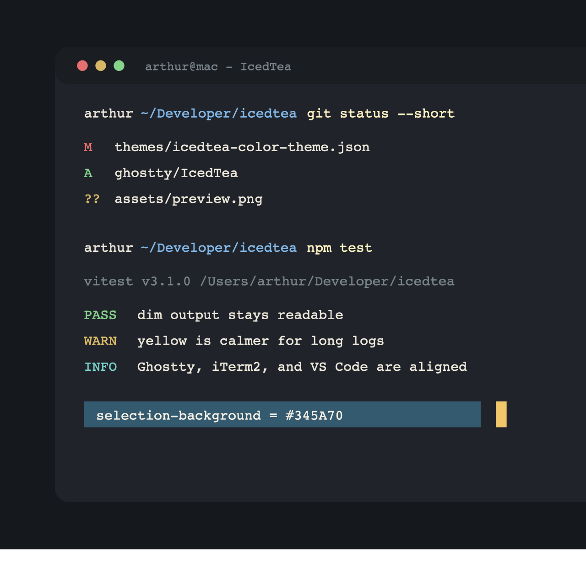

# IcedTea

IcedTea is a warm dark theme derived from Arthur's Cognac-style iTerm2 setup.
It keeps the soft charcoal terminal feel, but is tuned for long CLI sessions:
larger readable text, visible dim output, calmer warning/error colors, and
separable ANSI colors for `git`, test output, logs, and prompts.



## Files

- `iterm/IcedTea.itermcolors`: importable iTerm2 color preset.
- `ghostty/IcedTea`: Ghostty theme file.
- `package.json`: VS Code/Cursor theme extension manifest.
- `themes/icedtea-color-theme.json`: VS Code/Cursor color theme.

## Install

### Ghostty

Copy the theme into Ghostty's custom theme directory:

```sh
mkdir -p ~/.config/ghostty/themes
cp ghostty/IcedTea ~/.config/ghostty/themes/IcedTea
```

Then add this to `~/.config/ghostty/config`:

```text
theme = IcedTea
```

Reload Ghostty's configuration after changing the theme.

### iTerm2

Import `iterm/IcedTea.itermcolors` from:

```text
iTerm2 Settings -> Profiles -> Colors -> Color Presets -> Import
```

### VS Code or Cursor

Clone this repo into your local extensions directory and reload the editor.

```sh
git clone https://github.com/ArtSabintsev/icedtea.git ~/.vscode/extensions/arthur.icedtea
```

For Cursor:

```sh
git clone https://github.com/ArtSabintsev/icedtea.git ~/.cursor/extensions/arthur.icedtea
```

Then select `IcedTea` from the color theme picker.

## Core Palette

| Role | Hex |
| --- | --- |
| Background | `#20242A` |
| Foreground | `#ECE6DA` |
| Bold | `#FFF2C2` |
| Cursor | `#F0C76A` |
| Selection | `#345A70` |
| Red | `#E66F6F` |
| Green | `#86D38B` |
| Yellow | `#D7B866` |
| Blue | `#82B7E8` |
| Magenta | `#C997E8` |
| Cyan | `#78D0C8` |
| Dim | `#78828B` |
